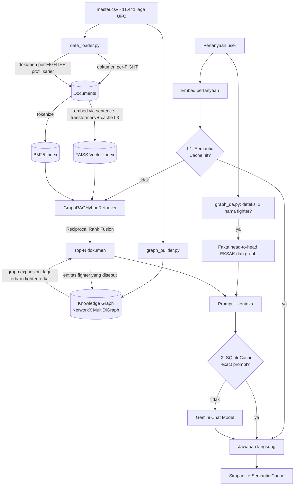

# UFDC GraphRAG — UFC Fight Database

Sistem **GraphRAG** (Graph-enhanced Retrieval-Augmented Generation) di atas
data pertandingan UFC (`data/master.csv`, 11.441 laga). Menggabungkan:

- 🔎 **Hybrid retrieval**: pencarian **vektor/semantik** (FAISS + embedding
  sentence-transformers lokal) digabung dengan pencarian **leksikal/kata-kunci** (BM25) memakai
  **Reciprocal Rank Fusion (RRF)**.
- 🕸️ **Knowledge graph** (NetworkX) berisi relasi Fighter ↔ Fight ↔ Event,
  dipakai untuk (a) **memperkaya konteks** hasil retrieval (graph expansion)
  dan (b) menjawab pertanyaan **head-to-head** secara **eksak**, tanpa
  LLM perlu "mengingat" atau menghitung sendiri.
- 🧠 **LangChain** sebagai lapisan orkestrasi (LCEL chain) + **Gemini API**
  (`langchain-google-genai`) untuk generasi jawaban. Embedding tidak memakai Gemini.
- ⚡ **Cache 3 lapis** (semantic query cache, LLM exact-prompt cache,
  embedding cache) supaya hemat biaya & latensi pada pertanyaan berulang.

Dibuat & diuji dengan `langchain` 1.4.x / `langchain-google-genai` 4.4.x
(per September 2026). Dokumentasi terstruktur tersedia di [`docs/`](docs/README.md).

---

## Arsitektur



### Kenapa hybrid, bukan vektor saja?

- **Vektor (FAISS)** unggul menangkap **makna**: "siapa petinju bertangan
  kidal yang jago bertahan takedown" walau kata-katanya tidak persis sama
  dengan dokumen.
- **BM25** unggul untuk **istilah eksak**: nama orang, nama event, istilah
  teknik ("guillotine", "spinning backfist") yang seringkali kurang
  "menonjol" secara embedding tapi krusial secara leksikal.
- **RRF** (bukan sekadar rata-rata skor) dipakai karena skala skor cosine
  similarity vs BM25 tidak sepadan — RRF menggabungkan berdasarkan
  **peringkat**, bukan nilai skor mentah, sehingga lebih robust.

### Kenapa "Graph" (bukan RAG biasa)?

RAG biasa hanya mengembalikan potongan teks yang paling mirip dengan
pertanyaan. Untuk pertanyaan seperti *"bagaimana performa Jon Jones
belakangan ini?"*, satu dokumen laga saja tidak cukup — perlu **beberapa
laga terakhir** seorang fighter, terhubung lewat identitas fighter yang
sama. Knowledge graph di proyek ini menyimpan relasi tersebut secara
eksplisit sehingga sistem bisa **menelusuri graph** (bukan cuma mencari
kemiripan teks) untuk melengkapi konteks. Untuk pertanyaan **head-to-head**,
graph bahkan bisa memberi jawaban **100% eksak** (dihitung, bukan ditebak
LLM).

---

## Struktur folder

```
graphrag-ufc/
├── main.py                  # entrypoint ringkas: `python main.py build|ask`
├── config.py                # semua path & hyperparameter terpusat
├── requirements.txt
├── .env.example              # salin ke .env lalu isi GOOGLE_API_KEY
├── data/
│   └── master.csv            # dataset UFC (sudah disertakan)
├── storage/                  # dibuat otomatis oleh build_index.py (index, cache)
├── src/
│   ├── data_loader.py         # CSV -> dokumen teks natural-language
│   ├── graph_builder.py       # CSV -> knowledge graph + query helper (head-to-head dst.)
│   ├── embeddings.py          # factory sentence-transformers + cache
│   ├── vector_store.py        # build/load FAISS
│   ├── lexical_retriever.py   # BM25 retriever custom (di atas rank_bm25)
│   ├── hybrid_retriever.py    # RRF fusion + graph expansion
│   ├── graph_qa.py            # deteksi & jawab pertanyaan head-to-head eksak
│   ├── caching.py             # cache L1 (semantic) / L2 (LLM) / L3 (embedding)
│   └── rag_pipeline.py        # rakit semua jadi satu pipeline tanya-jawab
└── scripts/
    ├── build_index.py         # jalankan SEKALI: bangun semua index
    └── ask.py                 # CLI tanya-jawab (interaktif / sekali tanya)
```

---

## Instalasi

```bash
# 1. Buat virtual environment (disarankan)
python3 -m venv .venv
source .venv/bin/activate        # Windows: .venv\Scripts\activate

# 2. Install dependencies
pip install -r requirements.txt

# 3. Siapkan API key Gemini
cp .env.example .env
# lalu edit .env, isi GOOGLE_API_KEY=... (gratis di https://aistudio.google.com/apikey)
```

## Pemakaian

```bash
# Langkah 1 - bangun index (sekali saja, atau setiap kali master.csv berubah)
python main.py build
# setara dengan: python scripts/build_index.py

# Langkah 2 - tanya jawab interaktif
python main.py ask
# setara dengan: python scripts/ask.py

# Atau sekali tanya langsung dari terminal:
python main.py ask "Bagaimana rekor head to head Jon Jones vs Daniel Cormier?"
```

> ⚠️ `build_index.py` membuat embedding lokal untuk **±14.000 dokumen**
> (11.441 laga + ±4.100 profil fighter). Model sentence-transformers perlu
> diunduh saat pertama kali dipakai dan membutuhkan resource CPU/RAM.

### Contoh pertanyaan yang bisa dicoba

- "Siapa itu Khabib Nurmagomedov, bagaimana rekornya?"
- "Bagaimana rekor head to head Nick Diaz vs KJ Noons?"
- "Laga apa saja yang berakhir dengan submission armbar di kelas welterweight?"
- "Bandingkan gaya bertarung Jon Jones dan Daniel Cormier berdasarkan statistik mereka"
- "Petarung mana yang punya takedown defense terbaik di data ini?"

---

## Cache 3 lapis ("canggih")

| Lapis | Nama | Key | Efek saat hit | File |
|---|---|---|---|---|
| **L1** | `SemanticCache` | kemiripan **makna** pertanyaan (cosine similarity embedding, threshold `SEMANTIC_CACHE_THRESHOLD`) | skip retrieval **+** skip panggilan Gemini sepenuhnya | `storage/semantic_cache.pkl` |
| **L2** | `SQLiteCache` (bawaan LangChain) | **exact match** prompt akhir ke LLM | skip panggilan Gemini (retrieval tetap jalan) | `storage/llm_cache.sqlite` |
| **L3** | `PersistentCachedEmbeddings` | **exact match** sha256(teks) | skip perhitungan embedding lokal berulang | `storage/embedding_cache.sqlite` |

L1 paling agresif menghemat biaya (pertanyaan yang mirip walau beda kata
persis tetap kena cache), sementara L3 membuat `build_index.py` bisa
di-rerun berkali-kali tanpa membayar ulang embedding untuk dokumen yang
tidak berubah.

Atur sensitivitas L1 lewat `.env`:
```
SEMANTIC_CACHE_THRESHOLD=0.94   # makin tinggi = makin ketat (perlu makin mirip)
```

---

## Kustomisasi

- **Ganti model**: ubah `GEMINI_CHAT_MODEL` untuk generation dan
  `SENTENCE_TRANSFORMER_MODEL` untuk embedding lokal di `.env`.
- **Ganti dataset**: selama CSV lain punya struktur mirip (fighter merah/biru
  per baris), cukup ubah `CSV_PATH` di `.env`. Untuk struktur data yang
  jauh berbeda, sesuaikan `src/data_loader.py` (bentuk teks dokumen) dan
  `src/graph_builder.py` (skema graph).
- **Atur jumlah dokumen yang diambil**: `VECTOR_TOP_K`, `BM25_TOP_K`,
  `HYBRID_TOP_N`, `GRAPH_EXPAND_PER_FIGHTER` di `.env`.
- **Tambah tipe entitas graph baru** (mis. `referee`, `venue`): tambahkan
  node/edge baru di `graph_builder.build_knowledge_graph`, lalu manfaatkan
  di `hybrid_retriever._graph_expand` atau `graph_qa.py`.

---

## Keterbatasan & catatan biaya

- Build index awal membuat embedding lokal untuk seluruh dokumen — tidak ada
  biaya Gemini embedding, tetapi proses membutuhkan waktu CPU/RAM dan download
  model saat pertama kali berjalan.
- Deteksi nama fighter di `graph_qa.py` memakai substring/fuzzy match
  sederhana (`difflib`) — cukup cepat untuk beberapa ribu fighter, tapi
  bisa keliru untuk nama yang sangat mirip/ambigu. Untuk dataset jauh lebih
  besar, pertimbangkan multi-pattern matching (mis. Aho–Corasick).
  Untuk head-to-head, LLM diberi fakta EKSAK dari graph sehingga hasilnya
  tetap akurat selama nama berhasil terdeteksi.
- `LLM_TEMPERATURE` default `0.2` (jawaban cenderung faktual/konsisten);
  naikkan bila ingin gaya jawaban lebih variatif.
- Ini contoh referensi/starter project, bukan aplikasi produksi siap-pakai —
  belum ada auth, rate limiting, atau observability untuk trafik banyak
  pengguna.

---

## Troubleshooting / catatan versi

Ekosistem `langchain` bergerak sangat cepat (rilis v1.0 memindahkan banyak
modul lama — `CacheBackedEmbeddings`, `langchain.retrievers`, dsb — ke
paket terpisah `langchain-classic`). Proyek ini SENGAJA meminimalkan
ketergantungan pada modul yang sering berubah:

- BM25 dibangun langsung di atas `rank-bm25` (stabil, tidak bergantung
  modul `langchain.retrievers`).
- Cache embedding dibuat sendiri (`PersistentCachedEmbeddings`) di atas
  SQLite biasa, bukan `CacheBackedEmbeddings`.
- FAISS & `SQLiteCache` tetap memakai `langchain_community` (per versi
  yang diuji, ini masih berfungsi meski paket tersebut berstatus
  "sunset"/tidak aktif dikembangkan lagi). Jika suatu saat import ini
  gagal karena versi LangChain kamu lebih baru, coba:
  ```bash
  pip install langchain-classic
  ```
  lalu ganti baris importnya di `src/vector_store.py` /
  `src/caching.py` menjadi `from langchain_classic...` sesuai pesan error
  yang muncul (LangChain biasanya memberi petunjuk migrasi yang jelas).

Semua kode di repo ini sudah **diuji berjalan end-to-end** (build index +
tanya-jawab, termasuk graph expansion & 3 lapis cache) memakai versi paket
yang tercantum di `requirements.txt`.
