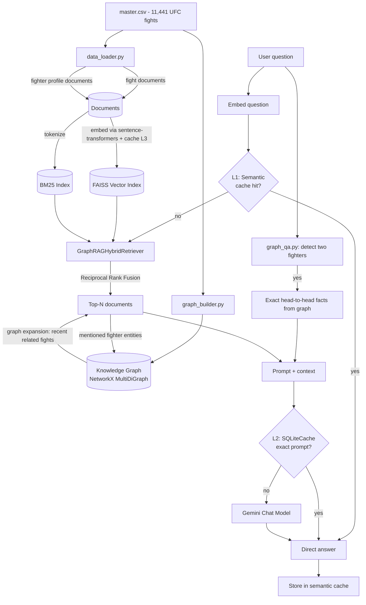

# UFC GraphRAG — UFC Fight Database

**UFDC GraphRAG** is a Graph-enhanced Retrieval-Augmented Generation system
built on UFC fight data (`data/master.csv`, 11,441 fights). It combines:

- Hybrid retrieval: local sentence-transformers embeddings with FAISS combined
  with BM25 lexical search using Reciprocal Rank Fusion (RRF).
- A NetworkX knowledge graph connecting Fighter, Fight, and Event entities. It
  enriches retrieved context and answers head-to-head questions exactly.
- LangChain orchestration with Gemini API (`langchain-google-genai`) for answer
  generation. Embeddings do not use Gemini.
- Three cache layers for semantic queries, exact LLM prompts, and embeddings.

Built and tested with `langchain` 1.4.x and `langchain-google-genai` 4.4.x
(as of September 2026). Structured documentation is available in
[`docs/`](docs/README.md).

---

## Architecture



### Why hybrid retrieval instead of vector search alone?

- **FAISS** is strong at semantic meaning, even when the query wording does
  not exactly match the document.
- **BM25** is strong for exact terms such as fighter names, event names, and
  techniques that may be less prominent in an embedding but are lexically
  important.
- **RRF** combines rankings instead of raw scores because cosine similarity
  and BM25 scores are not directly comparable.

### Why a graph instead of standard RAG?

Standard RAG returns text chunks that are most similar to a question. For a
question such as *"How has Jon Jones performed recently?"*, one fight document
is not enough; the system needs several recent fights connected to the same
fighter identity. This knowledge graph stores those relationships explicitly,
so the system can expand context through graph traversal. For head-to-head
questions, the graph can provide exact facts instead of asking the LLM to
calculate or guess them.

---

## Project structure

```text
graphrag-ufc/
├── main.py                  # compact entrypoint: `python main.py build|ask`
├── config.py                # centralized paths and hyperparameters
├── requirements.txt
├── .env.example              # copy to .env and set GOOGLE_API_KEY
├── data/
│   └── master.csv            # included UFC dataset
├── storage/                  # generated by build_index.py (indexes, caches)
├── src/
│   ├── data_loader.py         # CSV -> natural-language documents
│   ├── graph_builder.py       # CSV -> knowledge graph and query helpers
│   ├── embeddings.py          # sentence-transformers factory and cache
│   ├── vector_store.py        # build/load FAISS
│   ├── lexical_retriever.py   # custom BM25 retriever on rank_bm25
│   ├── hybrid_retriever.py    # RRF fusion and graph expansion
│   ├── graph_qa.py            # exact head-to-head question handling
│   ├── caching.py             # L1 semantic / L2 LLM / L3 embedding caches
│   └── rag_pipeline.py        # complete question-answering pipeline
└── scripts/
    ├── build_index.py         # build all indexes
    └── ask.py                 # interactive or one-shot CLI questions
```

---

## Installation

```bash
# 1. Create a virtual environment (recommended)
python3 -m venv .venv
source .venv/bin/activate        # Windows: .venv\Scripts\activate

# 2. Install dependencies
pip install -r requirements.txt

# 3. Configure the Gemini API key
cp .env.example .env
# then edit .env and set GOOGLE_API_KEY=... (get one at https://aistudio.google.com/apikey)
```

## Usage

```bash
# Step 1 - build indexes (once, or whenever master.csv changes)
python main.py build
# equivalent to: python scripts/build_index.py

# Step 2 - start interactive Q&A
python main.py ask
# equivalent to: python scripts/ask.py

# Or ask one question directly from the terminal:
python main.py ask "What is the head-to-head record between Jon Jones and Daniel Cormier?"
```

> `build_index.py` creates embeddings for approximately **14,000 documents**
> (11,441 fights and approximately 4,100 fighter profiles). The
> sentence-transformers model is downloaded on first use and requires CPU/RAM.

### Example questions

- "Who is Khabib Nurmagomedov, and what is his record?"
- "What is the head-to-head record between Nick Diaz and KJ Noons?"
- "Which welterweight fights ended with an armbar submission?"
- "Compare Jon Jones and Daniel Cormier based on their statistics."
- "Which fighter has the best takedown defense in this dataset?"

---

## Three-layer cache

| Layer | Name | Key | Effect on hit | File |
| --- | --- | --- | --- | --- |
| **L1** | `SemanticCache` | question **meaning** similarity (cosine similarity, `SEMANTIC_CACHE_THRESHOLD`) | skips retrieval and Gemini generation | `storage/semantic_cache.pkl` |
| **L2** | `SQLiteCache` (LangChain) | exact match of the final LLM prompt | skips Gemini generation; retrieval still runs | `storage/llm_cache.sqlite` |
| **L3** | `PersistentCachedEmbeddings` | exact `sha256(text)` match | skips repeated local embedding work | `storage/embedding_cache.sqlite` |

L1 provides the largest savings because semantically similar questions can hit
the cache even when their wording differs. L3 allows `build_index.py` to be
rerun without recomputing embeddings for unchanged documents.

```bash
# Configure L1 sensitivity in .env:
SEMANTIC_CACHE_THRESHOLD=0.94   # higher means stricter matching
```

---

## Customization

- **Change models**: set `GEMINI_CHAT_MODEL` for generation and
  `SENTENCE_TRANSFORMER_MODEL` for local embeddings in `.env`.
- **Change the dataset**: if another CSV has a similar structure, update
  `CSV_PATH`. For a different schema, update `src/data_loader.py` and
  `src/graph_builder.py`.
- **Tune retrieval size**: configure `VECTOR_TOP_K`, `BM25_TOP_K`,
  `HYBRID_TOP_N`, and `GRAPH_EXPAND_PER_FIGHTER` in `.env`.
- **Add graph entity types** such as `referee` or `venue` by adding nodes and
  edges in `graph_builder.build_knowledge_graph`, then using them in
  `hybrid_retriever._graph_expand` or `graph_qa.py`.

---

## Limitations and cost notes

- The initial index build creates local embeddings for all documents. There is
  no Gemini embedding cost, but the process requires CPU/RAM and downloads the
  model on first use.
- Fighter detection in `graph_qa.py` uses simple substring/fuzzy matching via
  `difflib`. Similar or ambiguous names may be detected incorrectly.
- `LLM_TEMPERATURE` defaults to `0.2` for factual, consistent answers; increase
  it for more variation.
- This is a reference/starter project, not a production-ready application. It
  does not yet include authentication, rate limiting, or observability.

---

## Troubleshooting and version notes

The `langchain` ecosystem changes quickly. Version 1.0 moved several older
modules, including `CacheBackedEmbeddings` and `langchain.retrievers`, into the
separate `langchain-classic` package. This project intentionally minimizes
dependencies on frequently changing modules:

- BM25 is built directly on `rank-bm25` instead of `langchain.retrievers`.
- Embedding caching is implemented with `PersistentCachedEmbeddings` and
  SQLite instead of `CacheBackedEmbeddings`.
- FAISS and `SQLiteCache` still use `langchain_community`. If an import fails
  after a LangChain upgrade, try:

  ```bash
  pip install langchain-classic
  ```

  Then update the imports in `src/vector_store.py` or `src/caching.py` to
  `from langchain_classic...` as indicated by the error message.

The repository includes tests for prompt behavior and embedding backend
selection. Run the full application flow after installing the dependencies and
building the local indexes.
