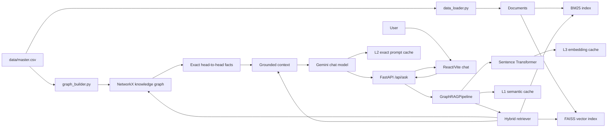

# Architecture

## Diagram sistem

## Lapisan sistem

### 1. Data layer

`data_loader.py` mengubah baris CSV menjadi dokumen fight dan profil fighter.
`graph_builder.py` membangun node serta edge fighter, fight, dan event.

### 2. Retrieval layer

FAISS mencari kemiripan semantik, sedangkan BM25 mencari kecocokan istilah
secara leksikal. `hybrid_retriever.py` menggabungkan peringkat keduanya dengan
RRF lalu memperluas konteks memakai knowledge graph.

### 3. Reasoning layer

`graph_qa.py` menangani pertanyaan head-to-head secara terstruktur. Fakta graph
dimasukkan ke prompt sebagai fakta eksak sebelum Gemini menyusun jawaban.

### 4. Generation layer

Gemini hanya berperan sebagai chat generator berdasarkan konteks yang sudah
dikumpulkan. Embedding tidak menggunakan Gemini secara default.

### 5. Delivery layer

FastAPI menyediakan endpoint untuk frontend. React menampilkan percakapan,
loading state, error state, markdown bold sederhana, dan background motion.

## Cache

- **L1 semantic cache**: melewati retrieval dan generation untuk pertanyaan yang
  sangat mirip.
- **L2 LLM cache**: menyimpan hasil untuk prompt akhir yang sama.
- **L3 embedding cache**: menyimpan embedding teks berdasarkan hash.
