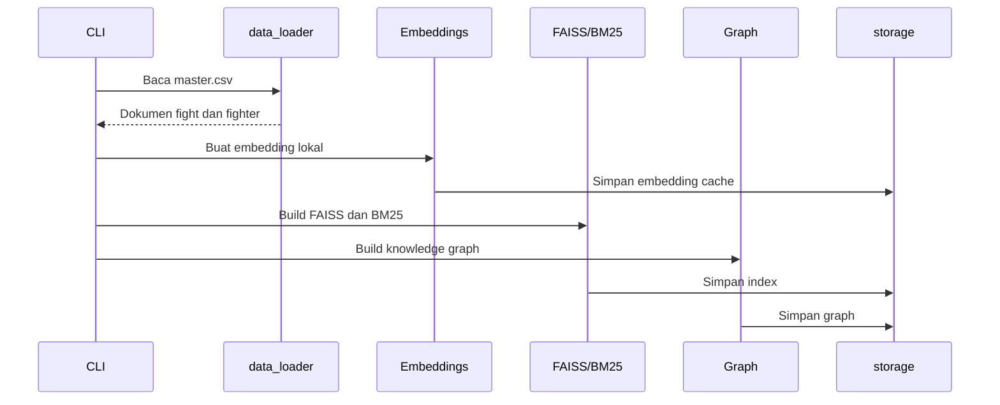

# Workflow

## A. Membangun index



Jalankan dengan:

```bash
python main.py build
```

Artifact disimpan di folder `storage/` dan tidak perlu dibangun ulang selama
teks sumber tidak berubah.

## B. Menjawab pertanyaan

1. Frontend mengirim pertanyaan ke `POST /api/ask`.
2. Pipeline membuat embedding query menggunakan sentence-transformer.
3. Semantic cache diperiksa.
4. Jika cache miss, FAISS dan BM25 mengambil kandidat dokumen.
5. RRF menggabungkan hasil retrieval.
6. Graph expansion menambahkan pertandingan terkait fighter.
7. Pertanyaan head-to-head diperiksa oleh `graph_qa.py`.
8. Konteks dikirim ke Gemini chat model.
9. Hasil dan sumber disimpan ke cache.
10. API mengembalikan jawaban ke frontend.

## C. Tampilan chat

Frontend menampilkan pertanyaan terakhir dan jawaban model sebagai dua bubble.
Marker markdown bold `**teks**` dirender menjadi bold, sedangkan marker sitasi
numerik seperti `[1]` disembunyikan dari tampilan pengguna.
